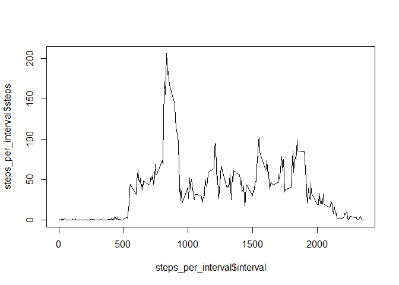

Reproducible Reasearch - Week 2 Project
========================
##Pablo Toapanta N.  

##Preparing the environment

```r
#Necesary libraries
library(dplyr)
library(ggplot2)
library(lattice)
```

##Loading and preprocessing the data

```r
#Reading CSV file
data<-read.csv("activity.csv", na.strings = "NA", header=TRUE, stringsAsFactors = FALSE)

#Transforming to date with format
data$date<-as.Date(data$date, "%Y-%m-%d")
```

##What is mean total number of steps taken per day?

```r
#Group data by date and sum the steps
steps_per_day<-data %>% na.omit() %>% group_by(date) %>% summarise(steps=sum(steps))

#Results Histogram
ggplot(steps_per_day, aes(x=steps)) + geom_histogram(bins=30)
```

<!-- -->

```r
#Reporting mean value
mean(steps_per_day$steps)
```

```
## [1] 10766.19
```

```r
#Reporting median value
median(steps_per_day$steps)
```

```
## [1] 10765
```

##What is the average daily activity pattern?

```r
#Grouping data by interval and taking the mean of the steps
steps_per_interval <- data %>% na.omit() %>% group_by(interval) %>% summarise(steps=mean(steps))

#Results plot
plot(steps_per_interval$interval, steps_per_interval$steps, type = "l")
```

<!-- -->

##Imputing missing values

```r
#Getting total missing values (NA)
sum(is.na(data))
```

```
## [1] 2304
```

```r
#Replacing missing values (NA) with mean value
new_data<-data
for(i in 1:nrow(new_data)) {
    if(is.na(new_data$steps[i])) {
        inter<-new_data$interval[i]
        steps_new<-steps_per_interval[steps_per_interval$interval==inter,]
        new_data$steps[i]=steps_new$steps
    }
}

#Creating a new data set without missing values
steps_per_day_noNA<-new_data %>% group_by(date) %>% summarise(steps=sum(steps))

#Results histogram
ggplot(steps_per_day_noNA, aes(x=steps)) + geom_histogram(bins=30)
```

<!-- -->

```r
#Reporting mean value
mean(steps_per_day_noNA$steps)
```

```
## [1] 10766.19
```

```r
#Reporting median value
median(steps_per_day_noNA$steps)
```

```
## [1] 10766.19
```

##Are there differences in activity patterns between weekdays and weekends?

```r
#Create a new column about weekday
new_data["dayType"]<-weekdays(new_data$date)
new_data$dayType[new_data$dayType %in% c("sábado", "domingo")]<-"weekend"
new_data$dayType[new_data$dayType != "weekend"]<-"weekday"

#Transform the new column
new_data$dayType<-as.factor(new_data$dayType)

#Grouping data by interval and day type and getting the mean
new_steps_per_interval <- new_data %>% group_by(interval, dayType) %>% summarise(steps=mean(steps))

#Results plot
xyplot(steps ~ interval | dayType, data=new_steps_per_interval, type="l", aspect = 1/2)
```

<!-- -->
